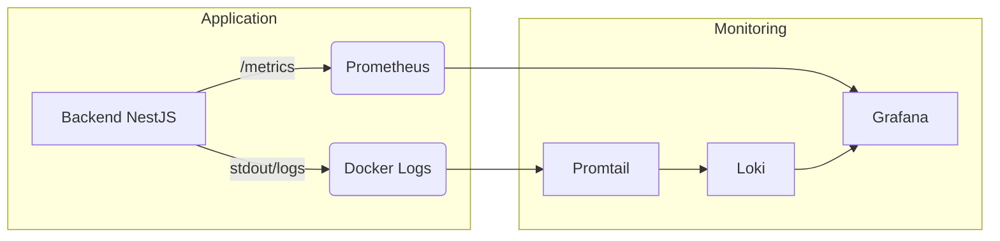

# Rapport d'Observabilité - TP6

## 🏗️ Architecture de la Stack

Le système de monitoring est basé sur la stack **PLG (Prometheus, Loki, Grafana)** pour assurer une visibilité complète :

- **Prometheus** : Collecte les métriques de performance du backend via l'endpoint `/metrics`.
- **Loki** : Agrège les logs envoyés par les conteneurs.
- **Promtail** : Agent de collecte qui surveille les logs Docker et les pousse vers Loki.
- **Grafana** : Interface de visualisation centralisant les données de Prometheus et Loki.

## 🚦 Matrice des Flux et Ports

| Service    | Port | Rôle                                               |
| ---------- | ---- | -------------------------------------------------- |
| Prometheus | 9090 | Stockage et requêtage des métriques (TSDB)         |
| Grafana    | 3001 | Dashboards et alertes (Visualisation)              |
| Loki       | 3100 | Base de données de logs                            |
| Backend    | 3000 | Application exposant les métriques via prom-client |

## 📈 Métriques Clés Configurées

### Taux de requêtes (Throughput)

Mesure du nombre de requêtes par seconde groupées par code HTTP.

**Requête :**

```promql
sum(rate(http_request_duration_seconds_count[1m])) by (route, code)
```

### Latence (Temps de réponse)

Calcul de la durée moyenne de traitement d'une requête.

**Requête :**

```promql
rate(http_request_duration_seconds_sum[1m]) / rate(http_request_duration_seconds_count[1m])
```

## 📜 Schéma d'Architecture



## 📸 Captures du Monitoring

### Dashboard Grafana

_À insérer : Capture du Dashboard avec les deux courbes de métriques (taux de requêtes et latence)_

### Vue Explore Loki

_À insérer : Capture de la vue Explore avec la requête `{container="backend-blue"}` affichant les logs collectés_
